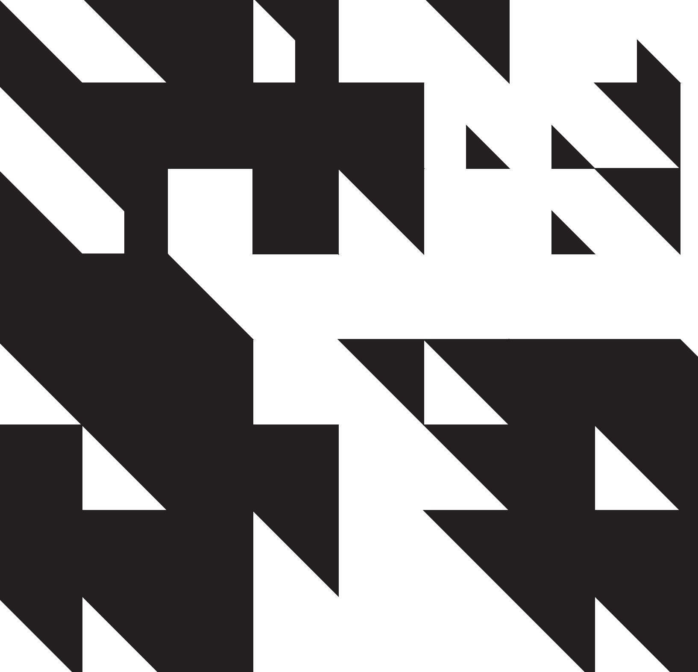

# AE LIVE Generator

P5.js sketch to replicate the artwork for [Autechre's AE LIVE](https://autechre.bleepstores.com/) releases.

[View in browser](index.html)



```
let w = 100;
let eg;

function setup() {
  createCanvas(windowWidth, windowHeight);
  eg = color('#211f20');
  stroke(eg);
  fill(eg);
  frameRate(0.5);
}

function draw() {
  background(255);

  iv = displayWidth/500
  as = Math.floor(random(1, 25 * iv));
  for (i = 0; i < as; i++) {
    a();
  }

  bs = Math.floor(random(1, 35 * iv));
  for (i = 0; i < bs; i++) {
    b();
  }

  bgl()

  //noLoop();
}

function mousePressed() {
  loop()
  draw()
}

function a() {
  f = Math.floor(random(-2, 3));
  lw = w;
  if (f < 0) {
    lw = w / f;
  }
  if (f > 0) {
    lw = f * w;
  }
  x = Math.floor(random(0, width / w)) * w;
  y = Math.floor(random(0, height / w)) * w;
  triangle(x, y, x + lw, y, x + lw, y + lw);
}

function b() {
  ww = Math.floor(random(-2, 3)) * w;
  s = Math.floor(random(0, width / w));
  sx = s * ww;
  ex = sx + s * ww;

  sy = s * ww;
  ey = sy + s * ww;

  xo = Math.floor(random(-width / w, width / w)) * w;

  beginShape();
  vertex(sx + xo, sy);
  vertex(sx + ww + xo, sy);
  vertex(ex + ww + xo, ey);
  vertex(ex + ww + xo, ey + ww);
  vertex(ex + xo, ey);
  vertex(sx + xo, sy);
  endShape();
}

function bgl() {
  stroke(255);
  noFill();
  rect(0, 0, width, height);
  stroke(eg);
  fill(eg);
}
```
