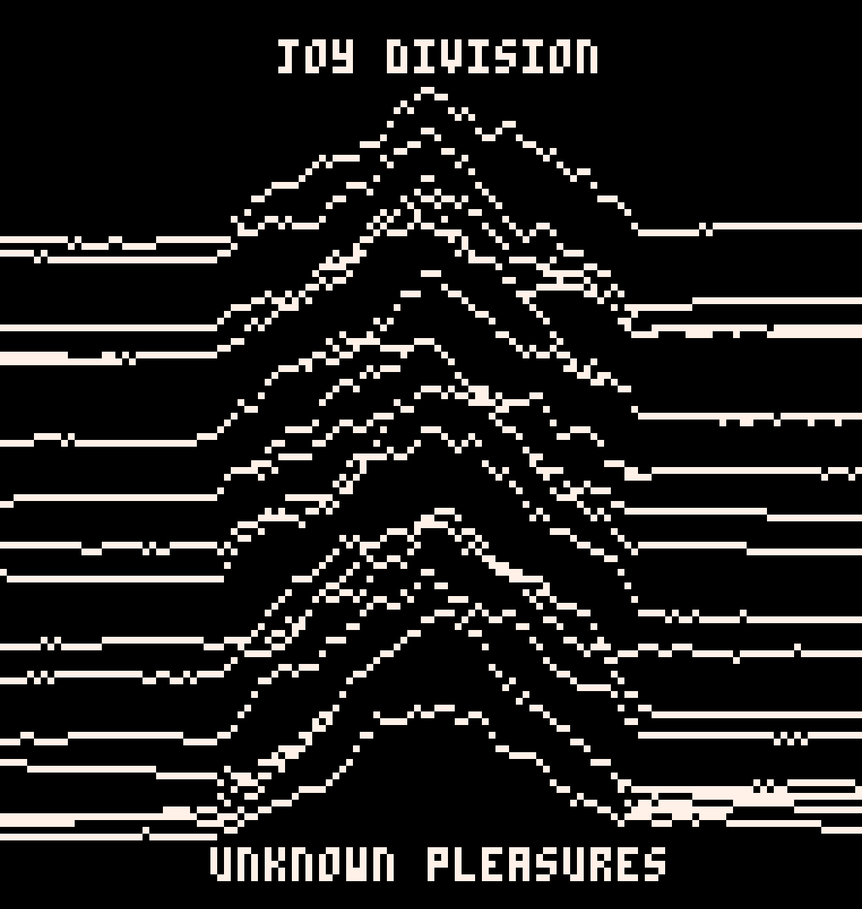

# Pico-8 Unknown Pleasures



A quick first attempt at coding on the Pico-8

```
WHITE = 7
BLACK = 0

function _init()
	rectfill(0,0,127,127, BLACK)
	y = 30
	for offset = 1, 95, 4 do
		for x = 1, 128 do
			if(x < 32) then y = (y) + littleRnd()  end
		    if(x > 96) then y = (y) + littleRnd()  end
			if(x < 64 and x > 32) then y = (y - 0.75) + bigRnd()  end
			if(x > 64 and x < 96) then y = (y + 0.75) + bigRnd()  end
			pset(x, offset + y, WHITE)
			line(x, offset + y + 1, x, 128, BLACK)
		end
	end
	print('joy division', 42, 1, WHITE)
	print('unknown pleasures', 32, 120, WHITE)
end

function bigRnd()
	return rnd(3) - 1.5
end

function littleRnd()
	return rnd(0.5) - 0.25
end

```
