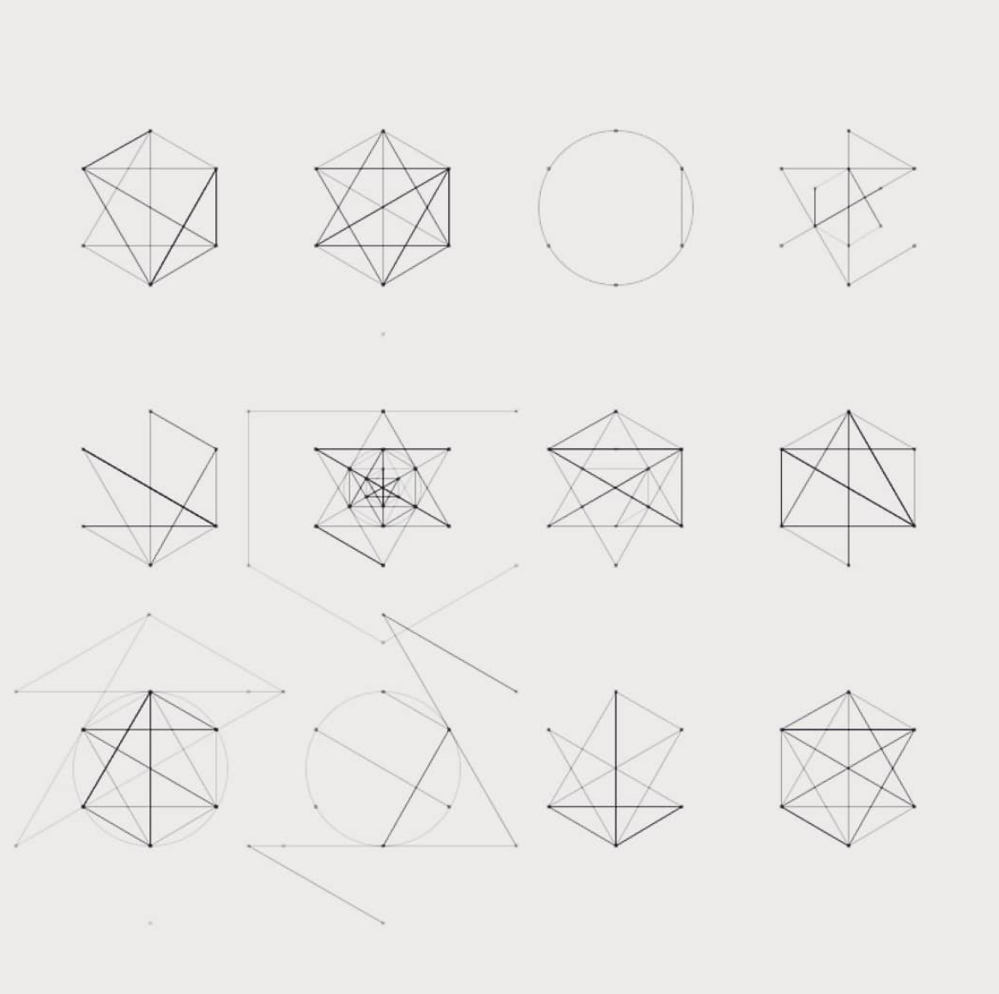
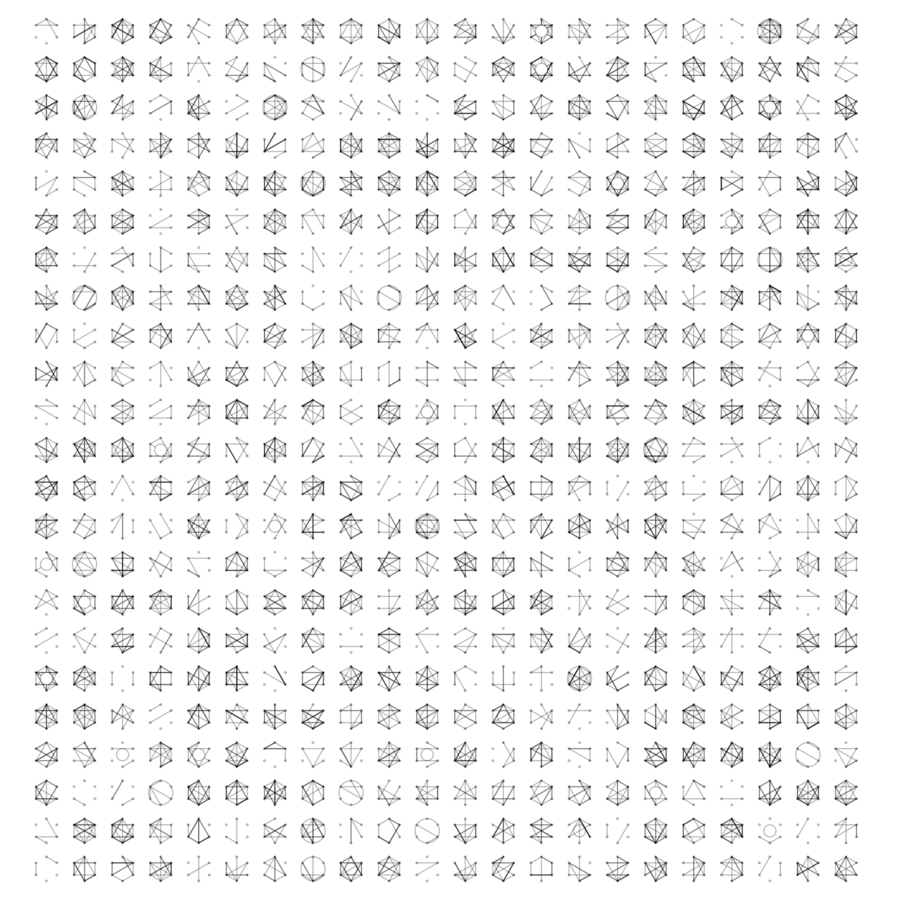

# Hexagrams

I wrote this a while back after a Todmorden local posted some [hexagram](https://en.wikipedia.org/wiki/Hexagram) sketches he'd done on Instagram.

To run yourself: download [Processing](https://processing.org) and copy the source below. Click the mouse to generate a new matrix, each time a .pdf is saved in the sketch folder (find it from within Processing by selecting the Sketch menu then _Show Sketch folder_ - if you want an .svg use an [online pdf to svg converter](https://cloudconvert.com/pdf-to-svg))

